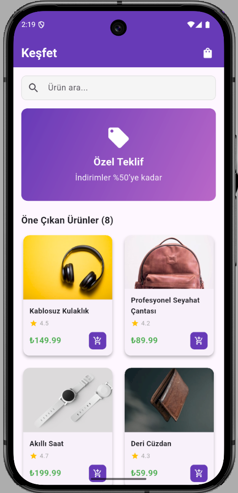
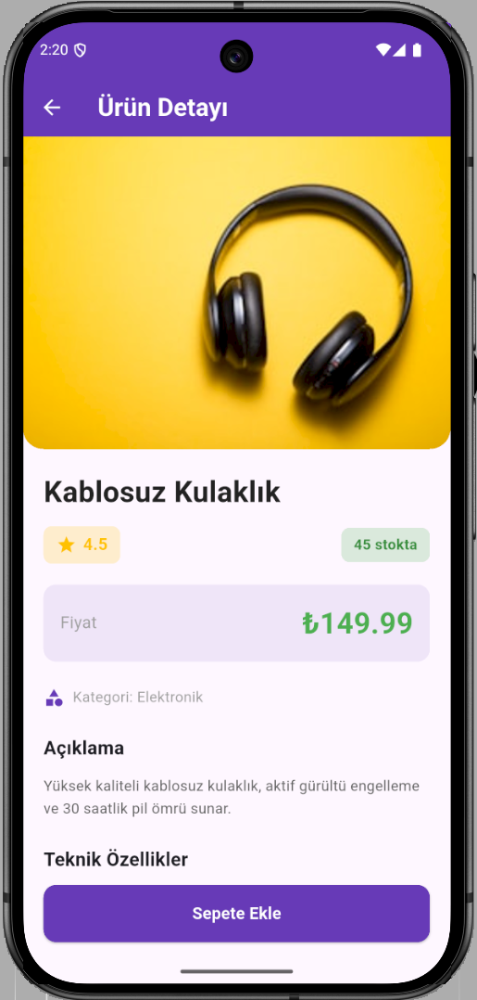
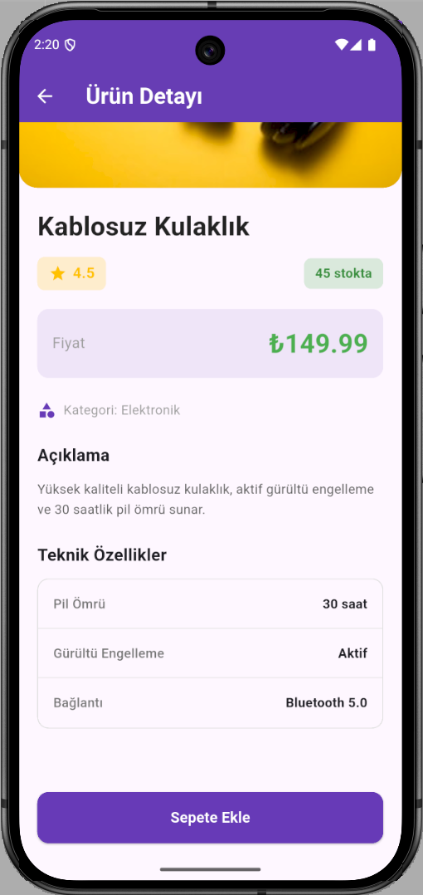
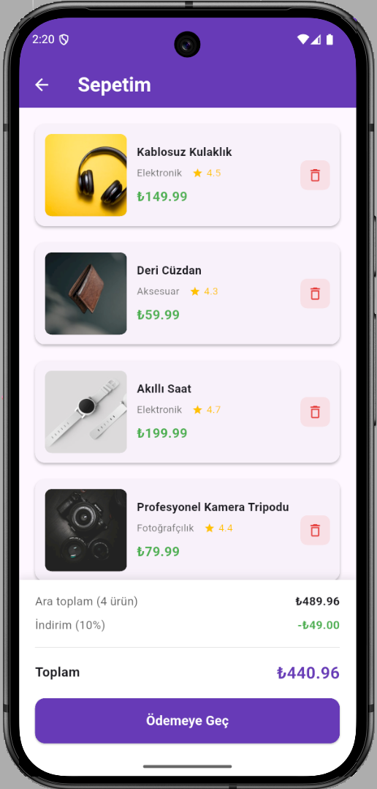

# 🛍️ E-Commerce Mobile Application

A modern, fast, and user-centric e-commerce mobile application designed to provide a seamless online shopping experience. This project focuses on high performance, clean UI/UX designs, and scalable architecture.

---

## 📱 Screenshots

Here are some visual insights from the application:

| Main Screen | Product Detail |
| :---: | :---: |
|  |  |

| Cart / Wishlist | Checkout Flow |
| :---: | :---: |
|  |  |

---

## 🚀 Key Features

* **Product Catalog & Filtering:** Browse items by categories with advanced search options.
* **Dynamic Cart System:** Add, remove, or update products in the cart seamlessly.
* **User Interface:** Clean, interactive, and fully responsive UI/UX components.

---

## ⚙️ Prerequisites & Environment

To run this project locally, ensure you have the following environment set up:
* **Flutter SDK:** ^3.x.x
* **Dart SDK:** Compatible with the selected Flutter version
* **IDE:** VS Code or Android Studio with Flutter/Dart extensions installed

---

## 🛠️ Installation & Setup

Follow these simple steps to get the project running on your local machine:

1. **Clone the Repository:**
   git clone [https://github.com/lAlsancakl/ecommerce-mobile-app.git](https://github.com/lAlsancakl/ecommerce-mobile-app.git)
   cd ecommerce-mobile-app

2. **Install Dependencies:**
   Fetch all the required packages listed in pubspec.yaml by running:
   flutter pub get

3. **Run the Application:**
   Ensure you have an emulator running or a real device connected, then execute:
   flutter run
